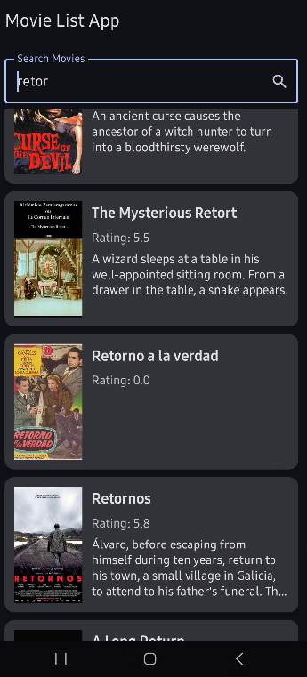
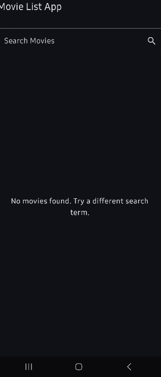
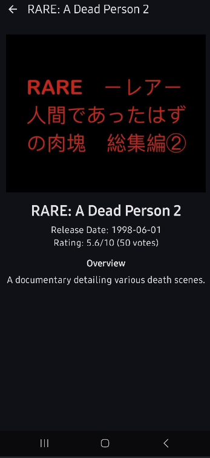

# 🎬 Movie List Application

An Android app to browse and search movies, built using **Jetpack Compose**, **MVI**, and **Clean Architecture**. Users can search, view, and navigate between movies and their details.

---

## 🧱 Architecture

This project follows **Clean Architecture** and uses the **MVI (Model-View-Intent)** pattern to structure the UI and logic.

### Layers:
- **UI Layer**: Jetpack Compose UI + ViewModels
- **Domain Logic**: Encapsulated in ViewModels
- **Data Layer**: Repository, Model, API
- **DI Layer**: Hilt dependency injection
- **Shared Layer**: Resource provider abstraction

---

## 📁 Project Structure
```
com.android.movielistapp/
│
├── common/ # Shared resources
├── data/ # Models, repository, network
├── di/ # Dependency injection modules
├── navigation/ # Navigation setup
├── ui/
│ ├── movielist/ # Movie list screen + ViewModel
│ ├── moviedetail/ # Movie detail screen + ViewModel
│ └── theme/ # App theme (colors, typography)
├── MainActivity.kt
└── MovieApp.kt
```


## ⚙️ Tech Stack

- 🧱 **Jetpack Compose** – Declarative UI
- 🚀 **Kotlin Coroutines & Flow** – Asynchronous and reactive programming
- 🏗️ **MVI Pattern** – Clear separation of concerns and state management
- 🔧 **Gradle Kotlin DSL** – Build configuration

---

## 📲 Features

- 🔍 Search for movies
- 🎞️ View movie details (navigated via side-effect)
- 🔄 Refresh movie list

---

## 🛠️ Setup Instructions

1. Clone the repo:
   ```bash
   git clone https://github.com/YOUR_USERNAME/movie-list-app.git
2. Don't forget to add API_KEY and BASE_URL in local.properties.

 ## 🧪 Limitations & Assumptions

### ⚠️ Limitations

1. **Online Only**
   - The application **requires an active internet connection** as all data is fetched live from the TMDB API.
   - No **offline caching** is implemented, so users cannot browse previously viewed content without internet access.

2. **No User Accounts or Personalization**
   - The app doesn't support login, favorites, watchlists, or personalized recommendations.

3. **Limited Data Displayed**
   - Only essential movie data is shown.
   - Extra info like **cast, reviews, trailers, production companies**, or **similar movies** is not included.

4. **Basic Error Handling**
   - Network and API error handling exists but is **generic**.
   - There’s little differentiation between error types.

5. **Search Functionality**
   - Search is **limited to movie titles**.
   - No support for filtering by genre, actor, or release year.

6. **UI/UX Scope**
   - The UI is functional and based on **Material Design**.
   - No advanced animations, transitions, or accessibility customizations have been added.

7. **No Persistent Local State**
   - App state (e.g., search query) is stored in **ViewModel only**.
   - Once the process is killed, **state is lost** (no Room DB or SharedPreferences used).

8. **Image Loading Optimization**
    - Uses **Coil** for image loading.
    - No additional optimization beyond Coil’s defaults is implemented.

9. **Limited Language/Region Support**
    - The app fetches data in **English**.
    - No UI support for changing locale/language for TMDB calls or UI strings.

---

### ✅ Assumptions

1. **Valid TMDB API Key**
   - Assumes a **valid API key** is configured in `local.properties` or equivalent and injected via `BuildConfig`.

2. **Stable TMDB API**
   - Expects the **API to remain stable** and its schema to match the app’s data models.

3. **Modern Android Device**
   - Targets **minSdk 21**, but is optimized for devices running **Jetpack libraries** (Compose, Hilt, etc.).

4. **Standard Permissions**
   - Requires only `INTERNET` permission.
   - No access to storage, location, or other sensitive data.

5. **Single-User Context**
   - Designed for **individual use** — no multi-user support or profile-based features.

6. **Development & Learning Focus**
   - Created primarily to **demonstrate modern Android architecture** and best practices.
   - Not intended as a commercial, production-ready app.

7. **English Language UI**
   - All UI strings are in **English**.
## 📸 Screenshots

### 🔍 Movie List (With Results)


### ❌ Movie List (No Results)


### 🎬 Movie Details

